🛡️ Virtual SOC Lab

Suricata IDS Integrated with Elastic SIEM Stack

Project Summary

This project demonstrates the design, deployment, and validation of a Virtual Security Operations Centre (SOC) lab environment using open-source security tools.

The objective was to:

Deploy a Network Intrusion Detection System (Suricata)

Integrate it with a SIEM platform (Elastic Stack)

Simulate reconnaissance attacks

Detect, forward, and visualize security alerts

Validate end-to-end threat detection workflow

The lab successfully detects reconnaissance scans (Example. Nmap SYN scans) and visualizes alerts within Kibana.

Objectives

The primary objectives of this lab were:

Configure a secure virtual network environment.

Deploy Suricata as a network IDS.

Enable and manage threat detection rules.

Simulate attack traffic from an attacker VM.

Forward IDS logs to Elasticsearch using Filebeat.

Visualize and analyze alerts in Kibana.

Validate real-time detection capability.

Lab Architecture

Architecture Overview –

Attacker VM: Generates malicious or test network traffic.↓Suricata IDS Server: Monitors incoming network traffic and detects suspicious activity andGenerates alert and log files based on detected threats.↓Filebeat: Collects Suricata log files andShips log data securely to Elasticsearch.↓Elasticsearch: Indexes and stores log data andEnables fast searching and analysis.↓Kibana Dashboard: Visualizes data from Elasticsearch andProvides dashboards, alerts, and security insights.

Components

Attacker Machine

Ubuntu 24.04

Tool: Nmap

Role: Simulate reconnaissance attacks

IDS Server

Ubuntu 24.04

Suricata

Elasticsearch 8.x

Kibana 8.x

Filebeat

Environment Setup

Virtualization Platform

Oracle VirtualBox

Host-Only Networking Mode

Network Range: 192.168.56.0/24

Machine Configuration

IDS Server

RAM: 15 GB

OS: Ubuntu 24.04 LTS

Interface monitored: enp0s8

Attacker VM

RAM: 10 GB

OS: Ubuntu 24.04 LTS

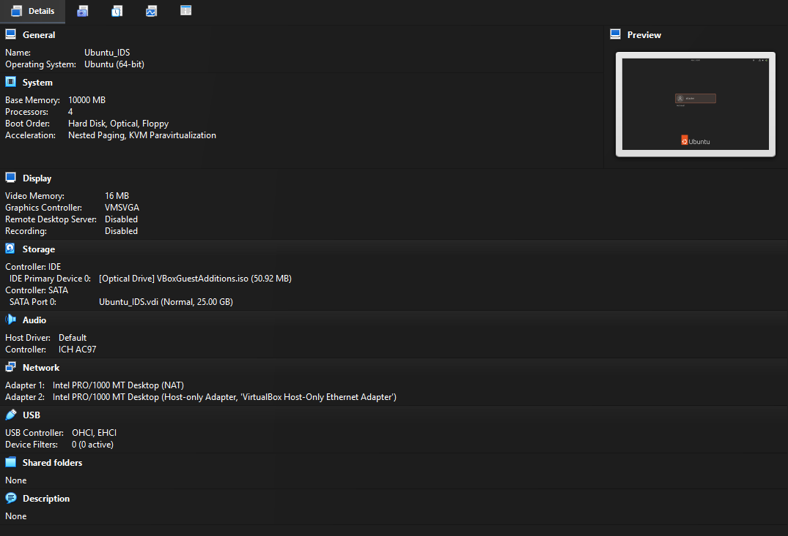

Network Configuration

Adapter Configuration

Adapter 1 → Host-Only Adapter (Promiscuous Mode: Enabled)

Adapter 2 → NAT (Internet to Download Required Packages)

Assigned IP Addresses

IDS Server: 192.168.56.103Attacker VM: 192.168.56.102

Connectivity verified using:

ping 192.168.56.103tcpdump -i enp0s8

Suricata Deployment

Installation

sudo apt updatesudo apt install suricata -y

Rule Management

Enabled Emerging Threats Open ruleset:

sudo suricata-update enable-source et/opensudo suricata-update update-sourcessudo suricata-update

Loaded Rules:~48,000+ detection rules

Interface Configuration

Configured Suricata to monitor:

enp0s8

Verified configuration:

sudo suricata -T -c /etc/suricata/suricata.yaml -i enp0s8

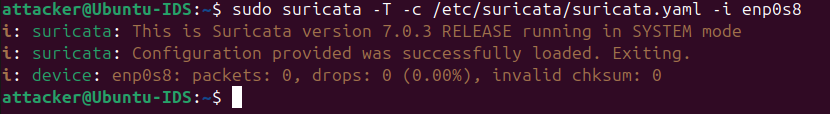

Service Validation

sudo systemctl status suricata

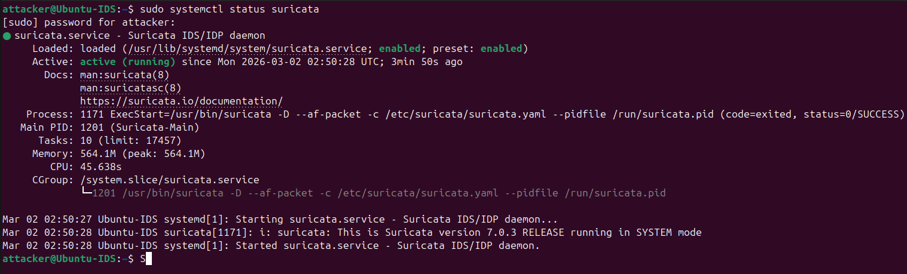

Confirmed active and running.

Attack Simulation

Attack traffic generated from Attacker VM:

nmap -sS 192.168.56.103nmap -A 192.168.56.103

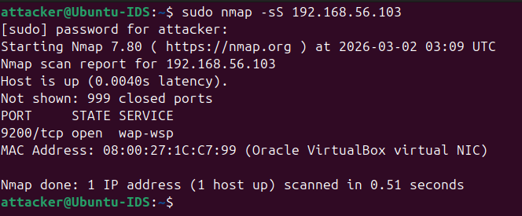

Observed Detection:

ET SCAN NMAP OS Detection Probe

TCP SYN scan patterns

Reconnaissance alerts

Verified alerts in:

/var/log/suricata/fast.log/var/log/suricata/eve.json

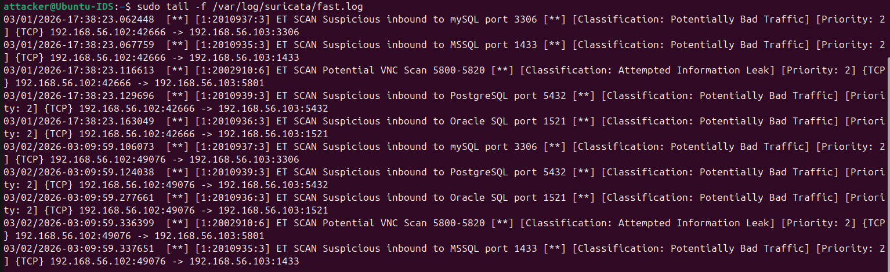

Elastic Stack Deployment

Elasticsearch

Configured as single-node cluster:

discovery.type: single-node

Verified cluster status:

curl -k -u elastic: https://localhost:9200

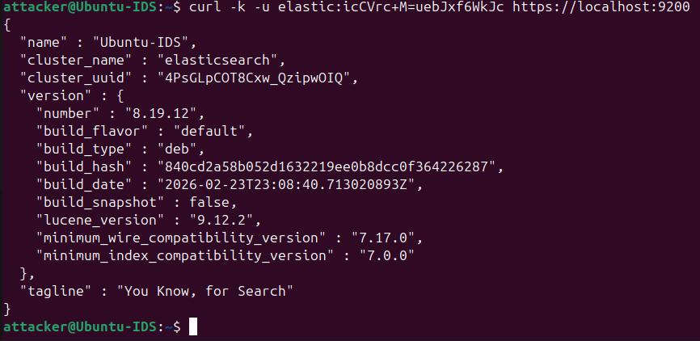

Cluster returned healthy response.

Kibana

Connected to Elasticsearch using enrollment token

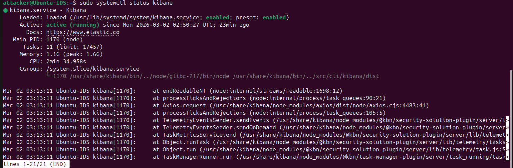

Verified access via:

http://192.168.56.103:5601

Created data view:

filebeat-*

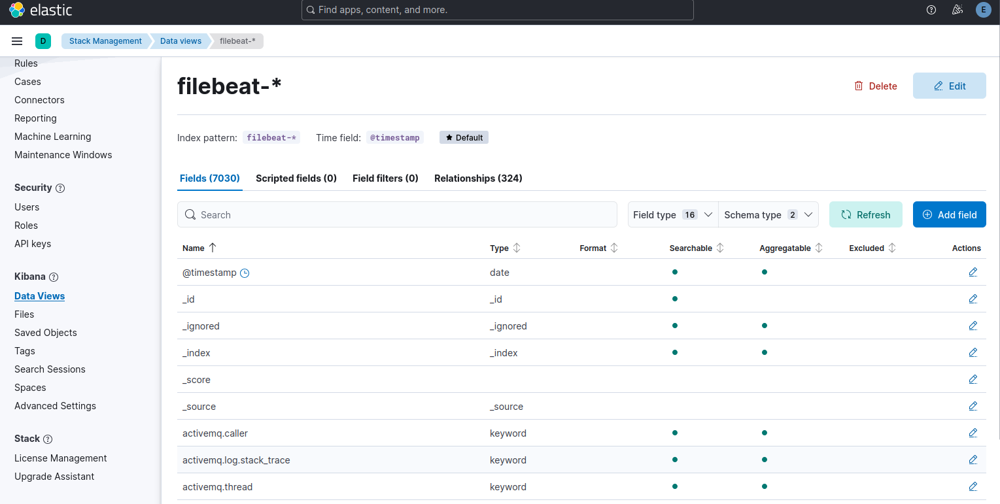

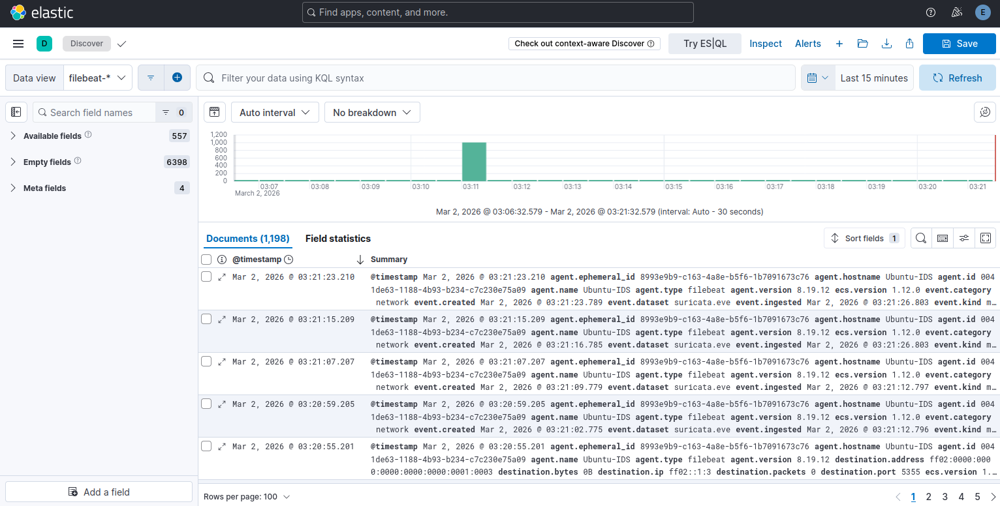

Filebeat Configuration

Module Activation

sudo filebeat modules enable suricata

Enabled eve fileset: enabled: truevar.paths: ["/var/log/suricata/eve.json"]

Setup

sudo filebeat setup

Service Start

sudo systemctl enable filebeatsudo systemctl start filebeat

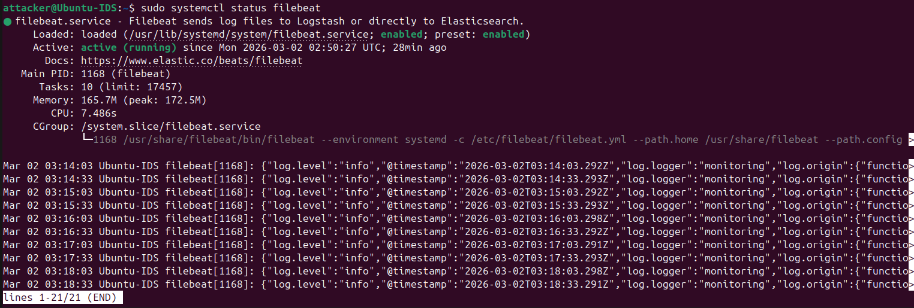

Verified ingestion via:

sudo filebeat test output

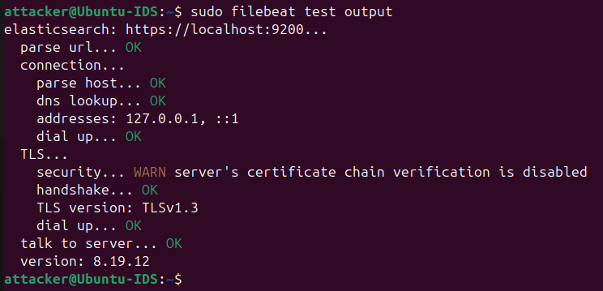

Log Flow Validation

Confirmed full pipeline:

Nmap scan executed

Suricata generated alert

eve.json updated

Filebeat forwarded log

Elasticsearch indexed event

Kibana displayed detection

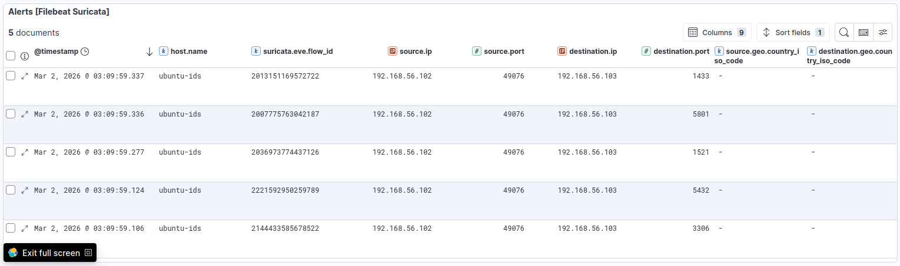

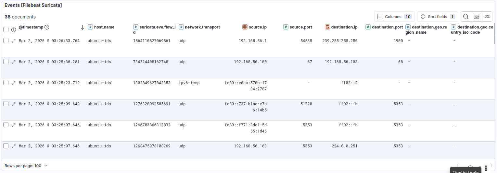

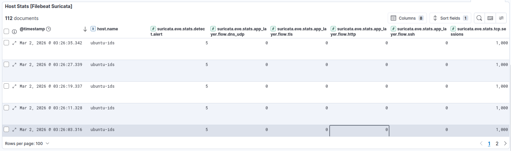

Detection Analysis

Example Alert:

ET SCAN NMAP OS Detection Probe

Mapped to:

MITRE ATT&CKT1595 – Active ScanningT1046 – Network Service Scanning

Severity: MediumClassification: Attempted Information Leak

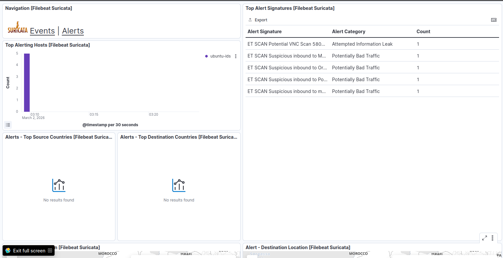

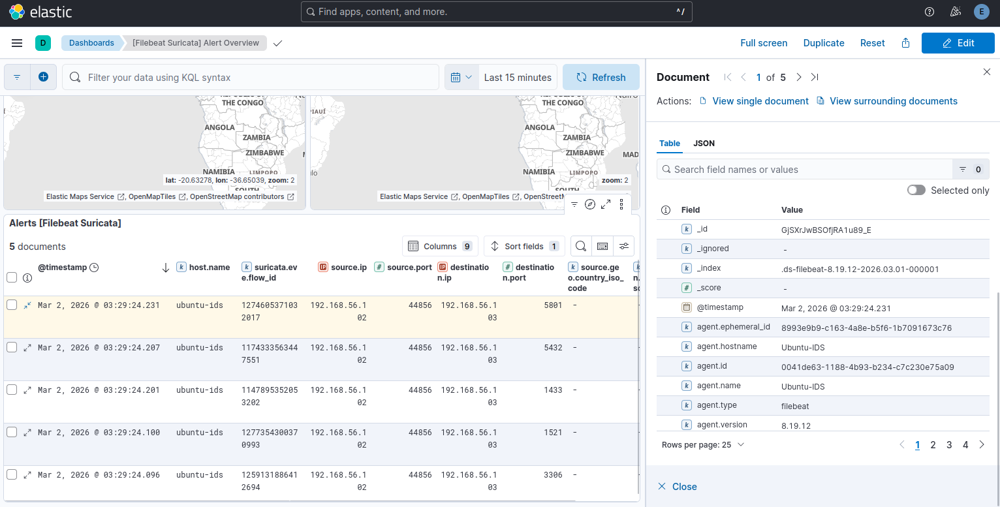

Troubleshooting Performed

During lab setup, the following issues were resolved:

Suricata interface mismatch

Missing ruleset loading

Elasticsearch bootstrap error

Kibana authentication issue

Filebeat module misconfiguration (eve fileset disabled)

Each issue was diagnosed using:

systemctl status

journalctl logs

Skills Demonstrated

Network configuration

IDS deployment & rule management

SIEM integration

Log pipeline troubleshooting

Threat detection validation

Elastic security architecture

Outcome

Successfully implemented a working SOC lab capable of:

Detecting reconnaissance attacks

Centralizing IDS logs

Visualizing security events

Performing initial threat investigation

This lab simulates real-world SOC infrastructure used in enterprise environments.

Future Enhancements

Add Zeek for network analysis

Add Wazuh for host-based detection

Create automated detection rules in Kibana

Build custom dashboards

Implement alert email notifications

Deploy using Docker
